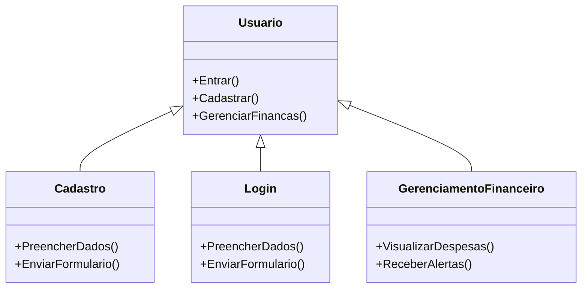

Descrição do Projeto
"De Olho nas Finanças" é uma ferramenta online para facilitar a gestão financeira pessoal. A plataforma permite aos usuários categorizar seus lançamentos financeiros, visualizar gráficos de despesas, receber alertas de contas a pagar, e muito mais.

Recursos Utilizados
HTML5 e CSS3: Estrutura e estilos da página.
JavaScript (jQuery): Interatividade e manipulação do DOM.
Bootstrap 4: Framework CSS para design responsivo.
Font Awesome: Biblioteca de ícones.
Bibliotecas e Frameworks:
Bootstrap: https://stackpath.bootstrapcdn.com/bootstrap/4.1.3/css/bootstrap.min.css
Font Awesome: https://use.fontawesome.com/releases/v5.3.1/css/all.css

Descrição do Código
index.html
Este arquivo contém a estrutura básica da página web, incluindo cabeçalho, seções principais e modais para login, cadastro e mais informações sobre recursos e benefícios.

script.js
Este arquivo contém as funções JavaScript para interações com os modais de login, cadastro e suporte. Utiliza jQuery para manipulação de eventos.

# Diagrama de Casos de Uso



# Diagrama de Classes

```mermaid

classDiagram
    class Usuario {
        -nome: string
        -email: string
        -senha: string
        +entrar(email: string, senha: string): boolean
        +cadastrar(nome: string, email: string, senha: string): boolean
    }

    class Sistema {
        +usuarios: Usuario[]
        +adicionarUsuario(usuario: Usuario): void
        +autenticarUsuario(email: string, senha: string): Usuario
    }

    class Transacao {
        -descricao: string
        -valor: number
        -data: date
        +cadastrarTransacao(descricao: string, valor: number, data: date): void
    }

    Usuario --> Sistema: usa
    Transacao --> Usuario: pertence
    ```
